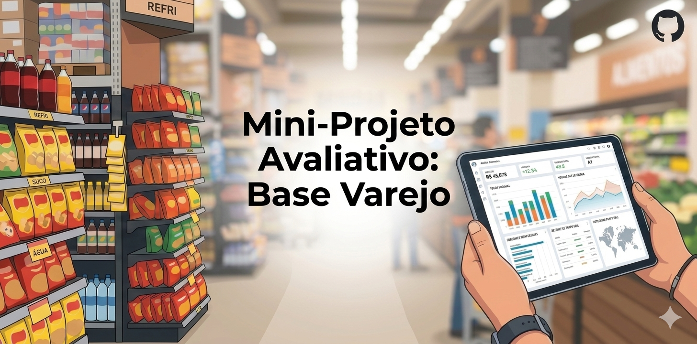

# Mini-Projeto Avaliativo: Análise Exploratória de Dados (AED) - Base Varejo
**Curso de Visualização de Dados e Business Intelligence** **Aluno(a):** [Andreza Tatiane Nascimento dos Santos Cordeiro] | **Turma:** [QA VDBI 2026/1 2]  
**Data de Entrega:** 01/06/2026  

---

## 1. Contextualização do Projeto
Este projeto consiste no desenvolvimento de um pipeline de **ETL (Extract, Transform, Load)** e uma **Análise Exploratória de Dados (AED)** aplicada ao setor varejista. A partir de uma base de dados bruta contendo registros de transações (compras, datas, identificação de clientes, produtos, categorias e perfis familiares), foi desenvolvida uma solução em Python para sanear os dados e extrair insights operacionais estratégicos.

O objetivo principal é transformar dados brutos e inconsistentes em uma estrutura limpa e confiável, ideal para alimentar dashboards de Business Intelligence (BI) ou modelos preditivos.

---

## 2. Estrutura das Sprints (Desenvolvimento)
O projeto foi executado seguindo a metodologia ágil de Sprints:
* **Sprint 1:** Importação da base `base_varejo.csv` e análise estrutural inicial (shape, dtypes e head).
* **Sprint 2 & 3:** Tratamento de strings, conversão de tipos de dados (ajuste da coluna `DATA` para `datetime`) e limpeza direcionada de valores nulos e duplicatas.
* **Sprint 4:** Aplicação de funções estatísticas descritivas sobre o perfil familiar dos clientes (`CL_FHL`).
* **Sprint 5 & 6:** Construção do relatório final, documentação do ecossistema no arquivo `README.md` e versionamento via Git.

---

## 3. Identificação e Controle do Documento (Dicionário de Dados)

Esta seção funciona como o mapa de metadados da base de dados do varejo, definindo o significado e as restrições de cada coluna utilizada no projeto:

| # | Coluna | Tipo de Dado | Descrição / Regra de Negócio |
|---|---|---|---|
| 1 | **DATA** | Datetime | Data em que a compra foi realizada (ajustada para formato temporal). |
| 2 | **CO_ID** | Integer/String | Identificação do número de compra (equivalente ao número da nota fiscal). |
| 3 | **CL_ID** | Integer/String | Identificação única do cliente (número de registro do cliente). |
| 4 | **CL_GENERO** | String (Categorização) | Sexo biológico informado pelo cliente no ato do cadastro. |
| 5 | **CL_EC** | Integer (Categorização) | Estado civil do cliente codificado de 1 a 5: **1:** Casado ou união estável; **2:** Divorciado; **3:** Separado; **4:** Solteiro; **5:** Viúvo. |
| 6 | **CL_FHL** | Integer | Número absoluto de filhos que o cliente possui. |
| 7 | **CL_SEG** | String (Categorização) | Segmentação econômica do cliente (Classes: A, B ou C). |
| 8 | **PR_ID** | Integer/String | Código identificador do produto (SKU - Stock Keeping Unit) adquirido. |
| 9 | **PR_CAT** | String (Categorização) | Categoria mercadológica à qual o produto adquirido pertence. |
| 10 | **PR_NOME** | String (Categorização) | Nome comercial do produto adquirido. |

---

## 4. Arquitetura da Solução & Regras de Negócio aplicadas
O script Python realiza o tratamento de dados seguindo critérios rígidos para evitar a distorção de indicadores comerciais:

* **Filtro de Nulos Críticos:** Linhas com valores vazios nas colunas `PR_CAT` (Categoria do produto) e `PR_NOME` (Nome do produto) foram descartadas, pois inviabilizavam a análise de comportamento do consumidor.
* **Deduplicação Inteligente:** Foram eliminadas linhas duplicadas que apresentavam o mesmo código de compra (`CO_ID`), cliente (`CL_ID`), data (`DATA`) e produto (`PR_ID`), corrigindo falhas de digitação ou redundâncias de sistema.
* **Padronização Temporal:** Conversão da data para o formato nativo do Pandas (`datetime64`), respeitando o padrão brasileiro (`dayfirst=True`).

---

## 5. Como Executar o Projeto

### Pré-requisitos
Certifique-se de ter o Python 3.x instalado em sua máquina, além das bibliotecas básicas de manipulação de dados (pandas,numpy e datetime).

### Instalação das Dependências
No terminal do seu VSCode (ou ambiente local), instale os pacotes necessários:
pip install pandas numpy

